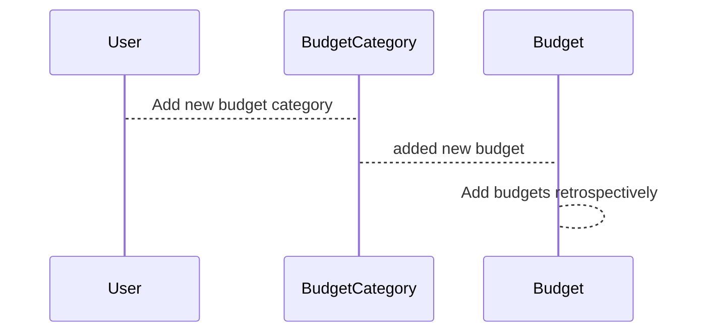

# Budget User Journey

A user creates a budget category with a cadence.
A cadence is either monthly or yearly.

The budget category should have a start date. If not specified uses current month as start date.  
The budget category can have an end date.

For monthly budget categories a budget instance at the beginning of each month will be created.
For yearly budgets categories not.

A user can enter expenses. An expense is tied to a category and a day (DD/MM)  
If month not given, current month is assumed. If day not given, current day is assumed.

A budget share is how a user puts into a budget to balance it out.  
One or more users can share a budget.

A budget compensation is how much a user puts in to compensate over-drafting a budget.

