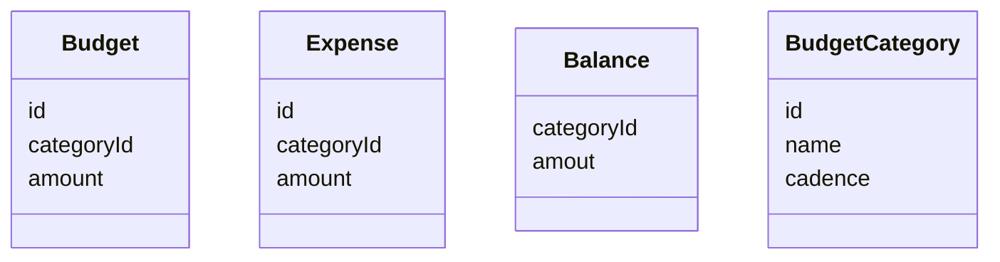
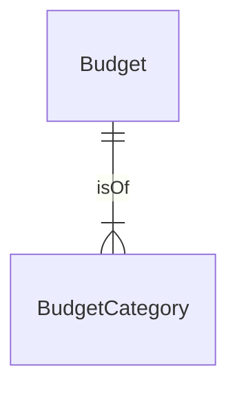

# Budget Design

```mermaid
classDiagram
    class Budget {
        id
        categoryId
        amount
    }
    class Expense {
        id
        categoryId
        amount
    }
    class Balance {
        categoryId
        amout
    }
    class BudgetCategory {
        id
        name
        cadence
    }
```

```mermaid
erDiagram
    Budget ||--|{ BudgetCategory: isOf
```

## Actions
- Budget is created
- Budget is updated
- Budget is deleted