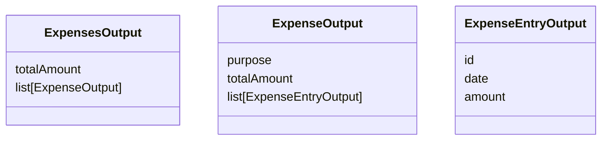

# Expenses

## Output

```mermaid
classDiagram
    class ExpensesOutput {
        totalAmount
        list[ExpenseOutput]
    }
    class ExpenseOutput {
        purpose
        totalAmount
        list[ExpenseEntryOutput]
    }
    class ExpenseEntryOutput {
        id
        date
        amount
    }
```